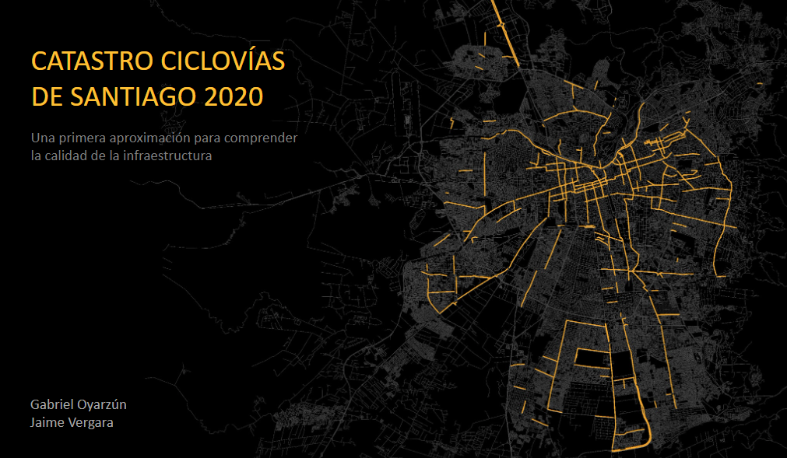

## 📄 Description

As part of the inventories conducted in collaboration with CEDEUS on the 🚴‍♂️ bike lanes of Greater Santiago between 2019-2022, and the research project supporting this publication [🔗 Mora (2021)](https://drive.google.com/file/d/1twCDibGu5onrBh7RtzvahDBQUuHsvcmH/view?usp=sharing), this 📊 data science project evaluates three bike lane quality indicators direved from regulations, design manuals, and academic sources, and one custom quality indicator proposed by us:  
- 📝 **Regulations** ([Ministry of Transport and Telecommunications, 2021](https://drive.google.com/file/d/1R5758sRyN_SN1e4AlhZG54nbbOQGZ3m_/view?usp=sharing)),  
- 📚 **Design manuals** ([Guide for Composition and Operational Design of Bike Lanes, 2019](https://drive.google.com/file/d/12npPNzV-C_9jRNPPgI2-s5krZYxMswyf/view?usp=sharing)), and  
- 🎓 **Academic sources** ([Merkuria, 2012](https://drive.google.com/file/d/1BRqqaboLDGDyY7uY7nbGsKPCBZhmBXlE/view?usp=sharing)).  
- 🌟 **Custom indicator** 
 

---

## 🎯 Results

Based on a 🗺️ shapefile containing the variables shown in Fig. 1, the following list of 📋 tables, 📈 charts, and 🗺️ maps is produced:

### 📋 Tables

- 1.a  Total kilometers of bike lanes and crossings  
- 1.b  Total kilometers of bike lanes and crossings by municipality  
- 2.a  Total kilometers by typology  
- 2.b  Total kilometers by typology by municipality  
- 3.a  Total kilometers by type of street service  
- 3.b  Total kilometers by type of street service by municipality  
- 4  Type of inoperability  
- 5.a  Distribution of operational vs. inoperational kilometers  
- 5.b  Distribution of operational vs. inoperational kilometers by municipality  
- 6.a  Distribution of operational vs. inoperational bike lane kilometers  
- 6.b  Distribution of operational vs. inoperational bike lane kilometers by municipality  
- 7.a  Distribution of kilometers by type of inoperability  
- 7.b  Distribution of kilometers by type of inoperability by municipality  
- 8.a  Distribution of kilometers by type of inoperability in crossings  
- 8.b  Distribution of kilometers by type of inoperability in crossings by municipality  

---

### 📈 Charts

- 1. Distribution of Crossing Operability Kilometers by Municipality
- 2. Distribution of Bike Lane Typologies
- 3. Distribution of Bike Lane Typologies by Municipality
- 4. Distribution of Typology Kilometers for Bike Lanes
- 5. Distribution of Typology Kilometers for Bike Lanes by Municipality
- 6. Distribution of Kilometers by Bike Lane Type
- 7. Distribution of Kilometers by Bike Lane Type by Municipality
- 8. Distribution of Operative and Inoperative Kilometers
- 9. Distribution of Operative and Inoperative Kilometers by Municipality
- 10. Distribution of Bike Lane Type Kilometers
- 11. Distribution of Bike Lane Type Kilometers by Municipality
- 12. Duplicate: Distribution of Bike Lane Type Kilometers by Municipality
- 13. Distribution of Inoperative Bike Lane Kilometers
- 14. Distribution of Inoperative Bike Lane Kilometers by Municipality
- 16. Distribution of Crossing Operability Kilometers
---

### 🗺️ Maps

- 1.  Map of quality according to decree 102  
- 2.  Map of quality according to Merkuria 2012  
- 3.  Map of quality according to regulations  
- 4.  Map of porposed quality indicator  

---

## 🛠️ Description of Main Functions

1. **📂 Data Preparation**  
   - `df <- GetDataReady(df)`: Prepares the data by reading a shapefile 📄 and generating a CSV file with data inconsistencies that must be manually reviewed and cleaned.  

2. **📊 Descriptive Statistics**  
   - `GetBasicAnalysis(df)`: Generates basic statistical 📋 tables and 📈 charts from the cleaned shapefile data.  

3. **📏 Quality Analysis**  
   - `GetQualityAnalysisPaper(df)`: Performs a quality analysis based on regulations 📜 and generates a corresponding 🗺️ map.  
   - `GetQualityAnalysisPObj(df)`: Performs a quality analysis independent of regulations and generates an 🌟 **objective quality map**.  
   - `GetQualityAnalysisMerkuria(df)`: Performs a quality analysis based on the Merkuria standard 📖 and generates a corresponding 🗺️ map.  
   - `GetQualityDecreto(df)`: Performs a quality analysis based on the Decree standard 🏛️ and generates a corresponding 🗺️ map.  

4. **🗺️ Maps**  
   - `MapaCalidadNormativa(df)`: Generates a 🗺️ map based on regulatory quality.  
   - `MapaCalidadObjetivo(df)`: Generates an 🌟 objective quality map.  
   - `MapaCalidadMerkuria(df)`: Generates a Merkuria quality map 📖.

